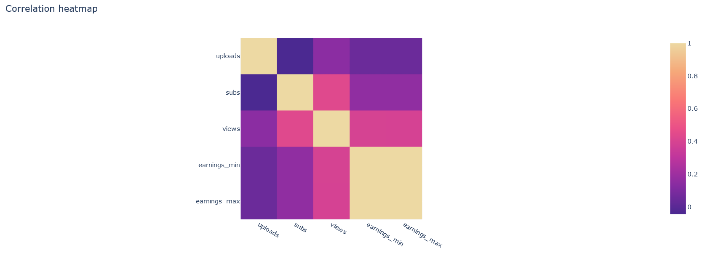

# Socialblade PAD

### To jest project zaliczeniowy z przedmiotu PAD studiów magisterskich sem I 21/22

## Scrapping

Dane pobrano za pomocą scrappingu ze strony https://socialblade.com/youtube/top/100 zawierającą ranking kanałów na youtubie.

Dane pobrano z trzech krajów: Niemiec, Polski i Rumunii i zapisano do pliku [`accounts_dirty.csv`](./accounts_dirty.csv). Pobrano informacje ze 100 najpopularniejszych (wg liczby subskrybentów) kanałów w danych krajach.
Są to nazwa kanału, liczba subskrybentów, wyświetleń i wrzuconych filmów, typ kanału oraz oszacowane miesięczne zarobki (górny i dolny zakres).

Kod znajduje się w pliku [`scrapper.py`](./scrapper.py).

**UWAGA:**
Scrapping z tej strony był bardzo problematyczny. Często natrafiano na błędy, ale informacje o błędzie nie były treściwe. Z tego powodu zdecydowano się pomijać te konto, które generowały błędy.

W trakcie działania aplikacji wykryto, że moją próbę scrappowania co (jak się okazało) nie był dozwolone :|

Z powyższych powodów nie mamy 300 rekordów tylko 211.

## Czyszczenie danych

Dane oczyszczono przy pomocy skryptu [`cleaner.py`](./cleaner.py).

- Zmieniono postać ilości subskrybentów, wyświetleń i wrzuconych filmów z postaci skróconej zapisanej w stringu (np. "2.5M") na liczbę.
- Podzielono oszczacowanie miesięcznych zarobków na dwie oddzielne kolumny tzn. z "$2.5K - $5K" stworzono dwie wartości 2500 i 5000.

Przekształcone dane zapisano do pliku [`accounts.csv`](./accounts.csv)

## Analiza danych

Dane przeanalizowano przy pomocy skryptu [`analytics.py`](./analytics.py).

- Zbadano zależność między zmiennymi dla minimalnych zarobków
- Zbadano korelacje między zmiennymi (najwięsza była między minimalnymi zarobkami i maksymalnymi zarobkami (zero zaskoczenia))
  
- Przanalizowano czy jest różnica zarobków między kanałami polskimi i niemieckimi (była widoczna różnica)
- Przanalizowano czy jest różnica wyświetleń między 20 (limit) najpopularniejszymi kanałami o tematyce edukacyjnej i rozrywkowej (była widoczna różnica)

## Dashboard

Wykresy znajdują się w podanym pliku: https://colab.research.google.com/drive/1U8b5LgJhQcAx37zY6lvlbsfjM75j_9wZ?usp=sharing

## Regresja

Przy pomocy skryptu [`regression.py`](./regression.py) przeprowadzono schemat regresji modelu ze względu na minimalne i maksymalne miesięczne zarobki.

Wykorzystano `LinearRegression` i `DecisionTreeRegressor`, a ewaluację danych przeprowadzono przy pomocy funkcji `r2_score(...)`, `mean_absolute_error(...)` oraz `np.sqrt(mean_squared_error(...))`.

Można zaobserwować, że najlepsze wyniki osiągnięto dla modelu `LinearRegression`.

## Klasyfikacja (a co mi tam)

Dodatkowo przy pomocy skryptu [`classiciation.py`](./classification.py) przeprowadzono schemat klasyfikacji modelu ze względu na państwo i typ kanału.

Wykorzystano `KNeighborsClassifier`, `LogisticRegression` i `DecisionTreeClassifier`, a ewaluację danych przeprowadzono przy pomocy funkcji `precision_score(...)`, `recall_score(...)`, `f1_score(...)` oraz `accuracy_score(...)`.

Tutaj widzimy, że nie było różnicy, którą funkcję zastosujemy do ewaluacji. Wszystkie dawały taki sam wynik dla tych samych przypadków.

Widzimy też, że metoda najbliższych sąsiadów oraz drzewa klasyfikacyjnego okazała się lepsza w przypadku kanałów, za to metoda regresji logicznej dała lepsze wyniki dla państw.
